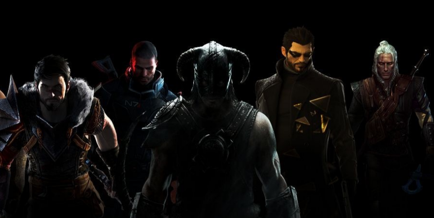

<!-- PROJECT LOGO -->
 

  

<h3 align="center">Video Games</h3>

<!-- TABLE OF CONTENTS -->

  
Table of Contents

  <ol>
    <li>
      <a href="#about-the-project">About The Project</a>
      <ul>
        <li><a href="#built-with">Built With</a></li>
      </ul>
    </li>
    <li>
      <a href="#getting-started">Getting Started</a>
      <ul>
        <li><a href="#prerequisites">Prerequisites</a></li>
        <li><a href="#installation">Installation</a></li>
      </ul>
    </li>
    <li><a href="#usage">Usage</a></li>
    <li><a href="#roadmap">Roadmap</a></li>
    <li><a href="#contributing">Contributing</a></li>
    <li><a href="#license">License</a></li>
    <li><a href="#contact">Contact</a></li>
    <li><a href="#acknowledgments">Acknowledgments</a></li>
  </ol>

<!-- ABOUT THE PROJECT -->
## About The Project

(<a href="#top">back to top</a>)

### Built With

* [HTML](https://html.com/)
* [CSS](https://www.w3.org/Style/CSS/Overview.en.html)
* [JavaScript](https://www.javascript.com/)
* [Free To Game API](https://www.freetogame.com/api-doc)

(<a href="#top">back to top</a>)

<!-- GETTING STARTED -->
## Getting Started

This is Live Website : ""

(<a href="#top">back to top</a>)

<!-- CONTACT -->
## Contact

Manal Alzeer - [ManalAlzeer](https://www.linkedin.com/in/manalalzeer) - ManalAlzeer01@gmail.com

(<a href="#top">back to top</a>)

<!-- ACKNOWLEDGMENTS -->
## Acknowledgments

* [css-tricks - complete-guide-grid](https://css-tricks.com/snippets/css/complete-guide-grid/)
* [RapidAPI Hub](https://rapidapi.com/hub)
* [w3schools](w3schools.com/)

(<a href="#top">back to top</a>)

